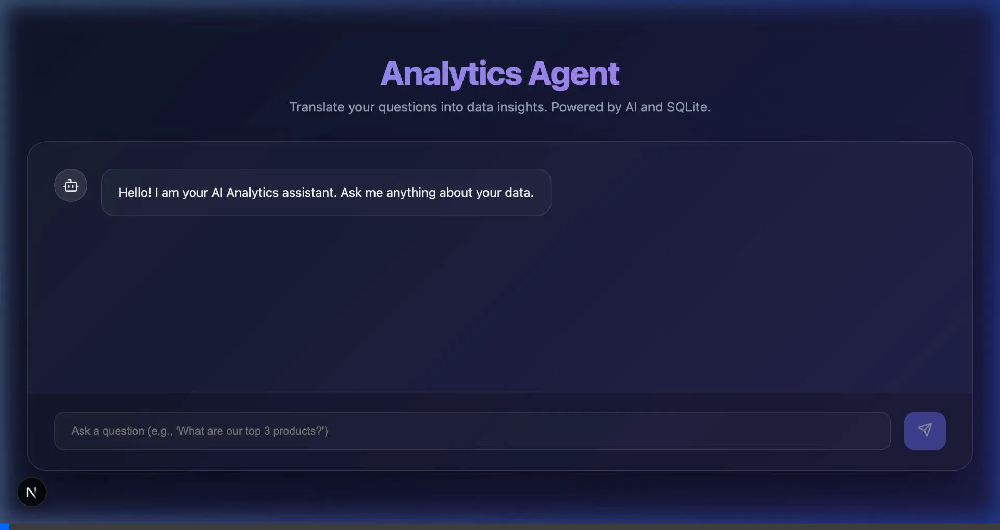
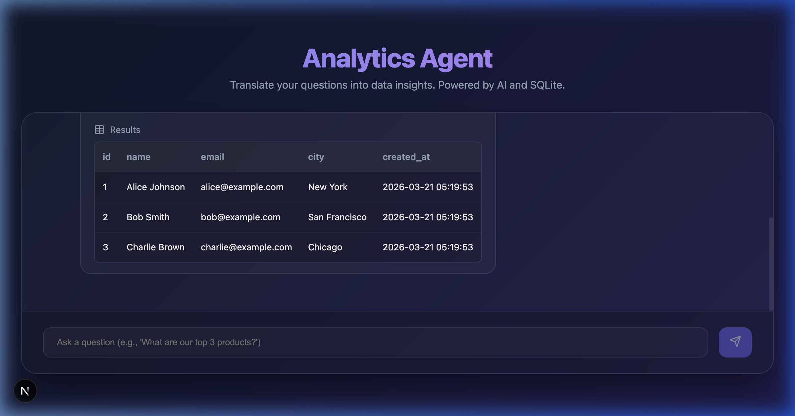

# AI-Powered Analytics Agent

A self-service analytics assistant that translates natural language questions into SQL queries, executes them against a SQLite database, and presents the results in a tabular format.

## 🚀 Overview

This agent leverages Large Language Models (LLMs) via OpenRouter to bridge the gap between business questions and data insights. It is built with Next.js and SQLite, providing a fast and interactive experience for data exploration.

### Key Features
- **Natural Language to SQL**: Converts complex questions into valid SQLite queries.
- **Schema Awareness**: The agent understands your database schema (tables, columns, types) to generate accurate queries.
- **SQL Validation**: Automatically validates and fixes generated SQL before execution.
- **Interactive Chat UI**: A modern, responsive interface for chatting with your data.
- **Tabular Results**: Displays data in a clean, sortable table.

## 🏗️ Architecture

The solution follows a modern full-stack architecture:

- **Frontend**: Next.js (App Router) with React, Lucide React icons, and a custom CSS design system.
- **Backend API**: Next.js API routes handle requests and coordinate between the AI agent and the database.
- **AI Agent**: Located in `lib/agent.ts`, it manages prompt engineering, LLM communication, and SQL extraction/cleaning.
- **Database Layer**: Uses `better-sqlite3` for high-performance data access. Schema extraction and seeding logic reside in `lib/db.ts`.

## 🛠️ Getting Started

### Prerequisites
- Node.js 18+
- An OpenRouter API Key

### Installation

1. Clone the repository:
   ```bash
   git clone https://github.com/lahirumhv/self-service-analytics-agent.git
   cd self-service-analytics-agent
   ```

2. Install dependencies:
   ```bash
   npm install
   ```

3. Configure environment variables:
   Create a `.env.local` file in the root directory:
   ```env
   OPENROUTER_API_KEY=your_api_key_here
   ```

4. Run the development server:
   ```bash
   npm run dev
   ```
   Open [http://localhost:3000](http://localhost:3000) to see the application.

## 🧪 Testing

The project includes a comprehensive testing suite:

- **Unit Tests**: `npm test` (Tests database and agent logic with Jest)
- **E2E Tests**: `npm run test:e2e` (Tests the full user flow with Playwright)

## 📺 Demo

Below is a recording of the agent in action, successfully translating a query and displaying results:



Typical successful query result:


## 📄 License

MIT
